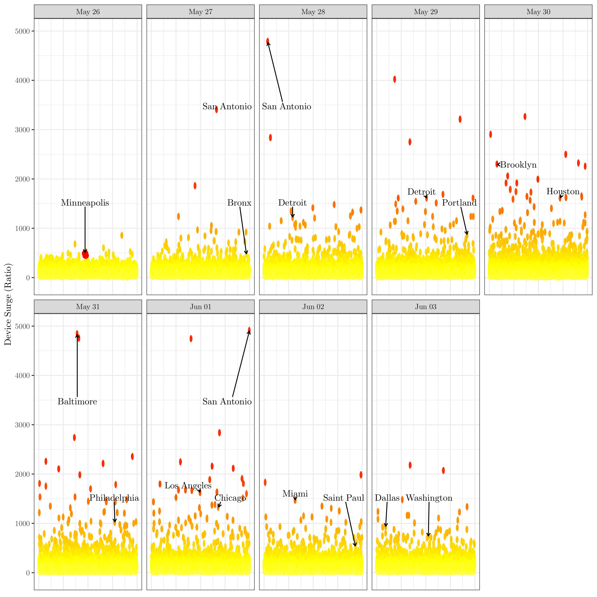
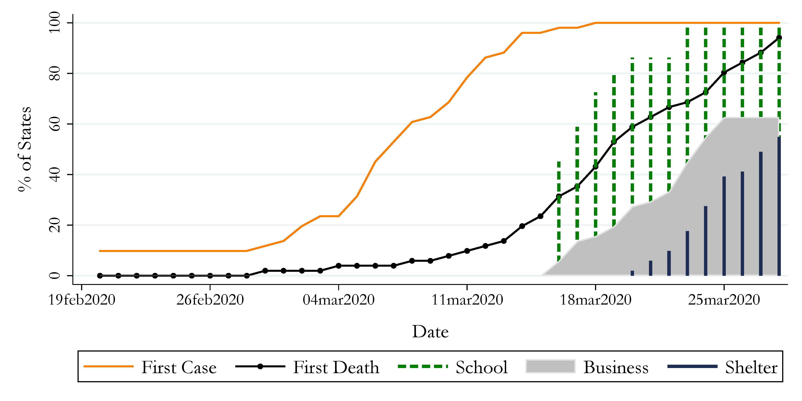
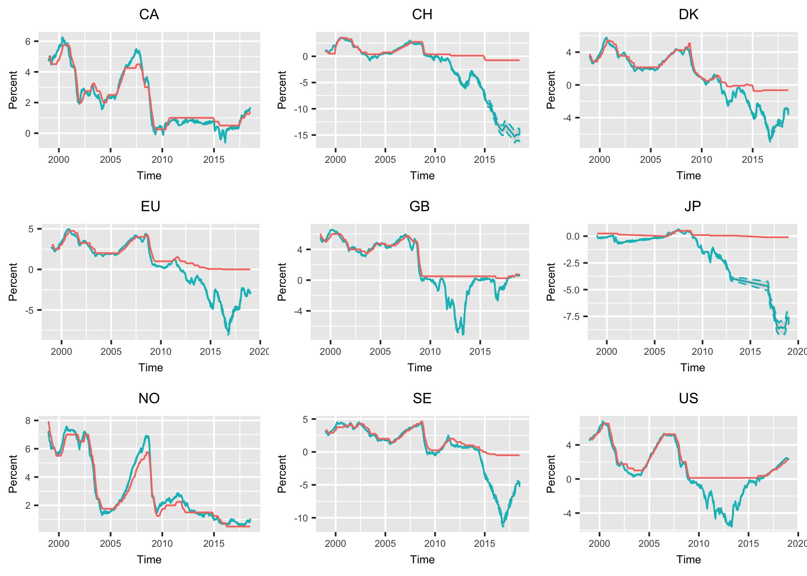



  **GitHub** 

Please find my GitHub commits and repositories here:

  **Science Skepticism Reduces Compliance with COVID-19 Shelter-in-Place Policies**

Git for the paper can be found [here](https://github.com/Davidvandijcke/science_skepticism_nature_hb), full replication materials are on [OpenICPSR](https://www.openicpsr.org/openicpsr/project/144861).

  

  **Census Block Group Level Presidential Election Results**

Datasets of CBG-level election results, for granular matching with, e.g., the American Community Survey, can be found [here](https://github.com/Davidvandijcke/Census-Block-Group-Level-2016-Presidential-Election-Results) for 2016 and [here](https://github.com/Davidvandijcke/Census-Block-Group-Level-2020-Presidential-Election-Results) for 2020.

Credits for the code basis to [Maria Milosh](https://twitter.com/miloshmk?lang=en). 

  **Using Mobile Device Traces to Improve Near-Real Time Data Collection During the George Floyd Protests**

The estimated protest locations and code to produce them can be found [here](https://github.com/Davidvandijcke/FLOYDTRACES_PUBLIC).

  

  **COVID-19: US State Lock-Down Policies - Dates of Implementation** 

The dataset with implementation dates of states' lock-down policies from our working paper "The COVID-19 Pandemic: Government vs. Community Action Across the United States" can be found [here](../files/CoronavirusStateTracking_15may_adj.csv). For the county-level dataset, see [this webpage](https://www.naco.org/resources/featured/coronavirus-disease-2019). 

NB only emergency declarations, business and school closures and stay-at-home policies are updated until May 15. When a policy was implemented after 12pm on a given date, we assign it to the next date.

  

  **Shadow Rate Estimates** 

Download [here](../files/SSR.csv)
  

Extends the series on the Bank of New Zealand website to additional OECD countries. 
See: https://www.rbnz.govt.nz/research-and-publications/research-programme/additional-research/measures-of-the-stance-of-united-states-monetary-policy/comparison-of-international-monetary-policy-measures

Please cite:   
Van Dijcke, D. (2019). Leaning Against the Wind When Inequality Bites Back. Working Paper.   
Krippner, L. (2012). Modifying Gaussian term structure models when interest rates are near the zero lower bound. Reserve Bank of New Zealand Discussion Paper, (2012/02).

