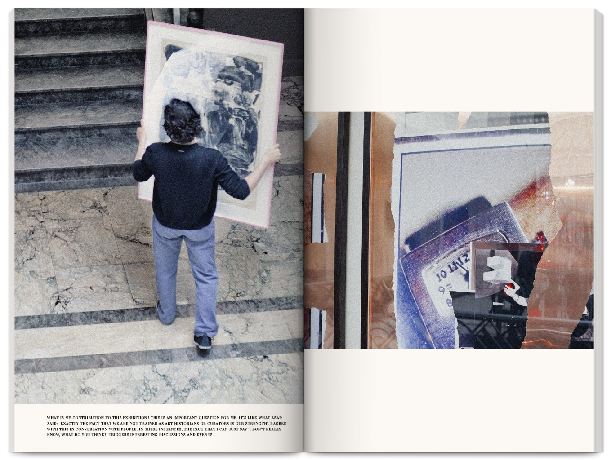
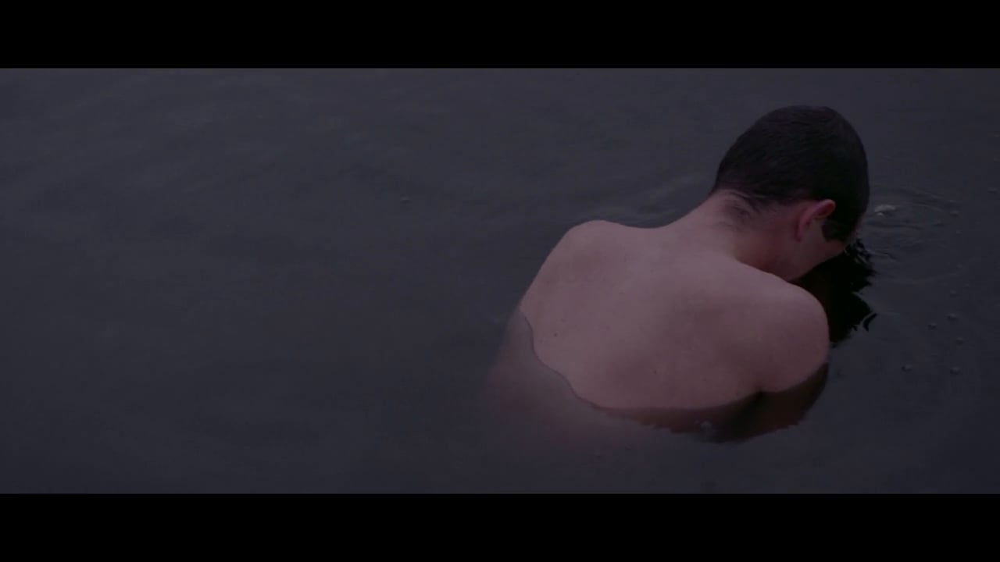
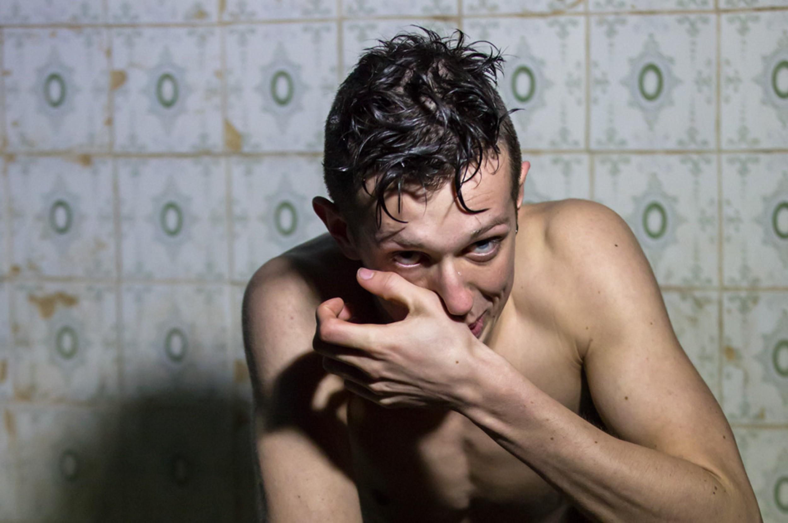



As Performer
======
*[Ivona, Princess of Burgundy](https://www.toneelhuis.be/nl/programma/yvonne-prinses-van-bourgondie/)*, Tibaldus / Toneelhuis 
  
"*One of the most unexpected shows on this year’s fringe. The role of Ivona is brilliantly and startlingly played by David van Dijcke, a towering, well-muscled male dancer who becomes Ivona simply by shutting down his facial expression, and adopting an unmistakable dragging limp.*" 
&ndash; Joyce McMillan in [The Scotsman](https://www.scotsman.com/lifestyle-2-15039/culture/edinburgh-festivals/theatre-review- ivona-princess-of-burgundia-1-4542136) \*\*\*\*, August 26, 2017 
   

*[Répétitions](https://www.villaempain.com/en/exhibitions/past-exhibitions/repetition/)*, Asad Raza / Fondation Boghossian 
  
   

*[It's Not About You Anymore](http://www.louisedegroef.com/fiction#/zielbeeld)*, Louise De Groef 
  
&ndash; Official Selection, Blowup International Arthouse Film Festival Chicago
&ndash; Honorable Mention, Canada Shorts Film Festival
&ndash; Best Short Film Finalist, Skepto International Film Festival (IT)
   

*[Othello](https://www.fabuleus.be/othello)*, Carl von Winckelmann / fABULEUS  
  
*"Top-notch text-based theatre"* 
&ndash; \*\*\*\* [De Morgen](https://davidvandijcke.github.io/images/othello-review.png)

