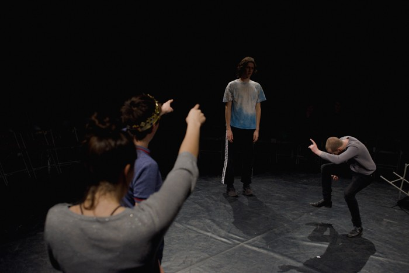



As Performer
======
* *[Ivona, Princess of Burgundy](https://www.toneelhuis.be/nl/programma/yvonne-prinses-van-bourgondie/)*, Tibaldus / Toneelhuis

"One of the most unexpected shows on this year’s fringe. The role of Ivona is brilliantly and startlingly played by David van Dijcke, a towering, well-muscled male dancer who becomes Ivona simply by shutting down his facial expression, and adopting an unmistakable dragging limp."\ 
&ndash Joyce McMillan in [The Scotsman](https://www.scotsman.com/lifestyle-2-15039/culture/edinburgh-festivals/theatre-review- ivona-princess-of-burgundia-1-4542136) \*\*\*\*, August 26, 2017

